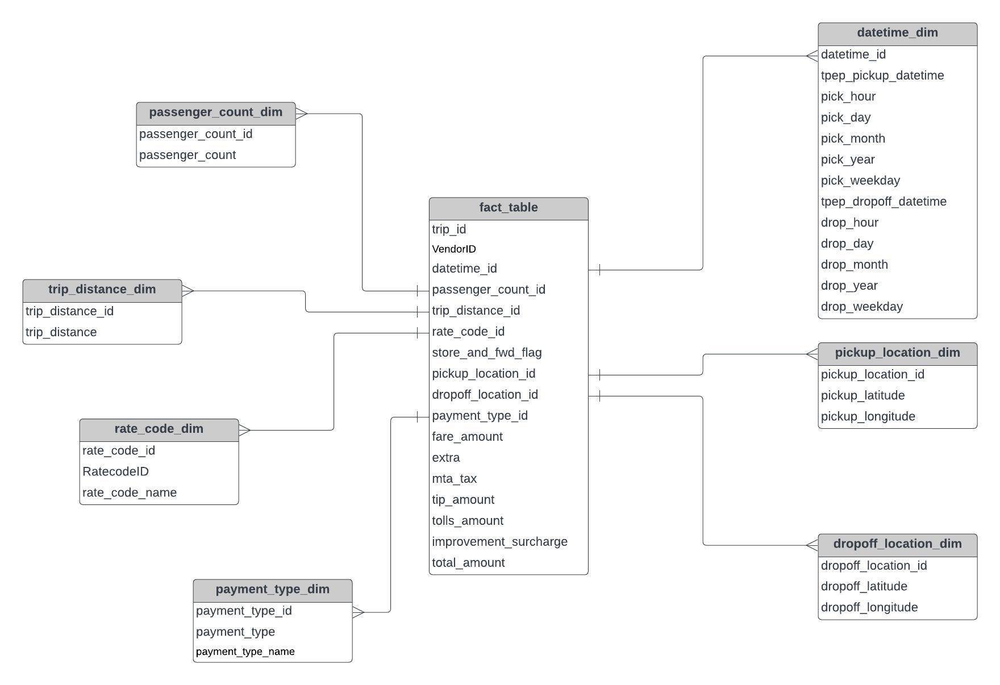

# Uber Data Analytics | Modern Data Engineering GCP Project

## Introduction
This project demonstrates an end-to-end ETL (Extract, Transform, Load) Data Engineering pipeline using Mage AI. The pipeline extracts Uber trip data, performs data cleaning and transformation using Python, stores the processed data in Azure Blob Storage, loads it into Google BigQuery for analytics, and finally visualizes insights in Looker Studio.

The project showcases a modern cloud-based data engineering workflow by integrating multiple cloud services and open-source tools.

## 🏗️ Project Architecture

The project follows an end-to-end ETL workflow:

1. Uber trip data is extracted using Mage AI.
2. Data is cleaned and transformed using Python.
3. The transformed dataset is stored in Azure Blob Storage.
4. Data is loaded into Google BigQuery.
5. Interactive dashboards are created using Power BI.
                    +------------------+
                    |   Uber Dataset   |
                    |   (CSV File)     |
                    +--------+---------+
                             |
                             v
                 +-----------------------+
                 |      Mage AI ETL      |
                 | Extract • Transform   |
                 |       • Load          |
                 +-----------+-----------+
                             |
                             v
                 +-----------------------+
                 | Azure Blob Storage    |
                 | Processed CSV Storage |
                 +-----------+-----------+
                             |
                             v
                 +-----------------------+
                 | Google BigQuery       |
                 | Data Warehouse        |
                 +-----------+-----------+
                             |
                             v
                 +-----------------------+
                 | Power BI Dashboard    |
                 | Analytics & Reports   |
                 +-----------------------+

| Technology         | Purpose                   |
| ------------------ | ------------------------- |
| Python             | Data Processing           |
| Mage AI            | ETL Pipeline              |
| Pandas             | Data Cleaning             |
| Azure Blob Storage | Store Processed Data      |
| Google BigQuery    | Data Warehouse            |
| Looker Studio      | Dashboard & Visualization |
| Git & GitHub       | Version Control           |

Modern Data Pipeine Tool - https://www.mage.ai/

Contibute to this open source project - https://github.com/mage-ai/mage-ai

## Dataset Used
TLC Trip Record Data
Yellow and green taxi trip records include fields capturing pick-up and drop-off dates/times, pick-up and drop-off locations, trip distances, itemized fares, rate types, payment types, and driver-reported passenger counts. 

Here is the dataset used in the video - https://github.com/darshilparmar/uber-etl-pipeline-data-engineering-project/blob/main/data/uber_data.csv

More info about dataset can be found here:
1. Website - https://www.nyc.gov/site/tlc/about/tlc-trip-record-data.page
2. Data Dictionary - https://www.nyc.gov/assets/tlc/downloads/pdf/data_dictionary_trip_records_yellow.pdf

## Data Model

## Complete Video Tutorial 
Video Link - https://youtu.be/WpQECq5Hx9g
